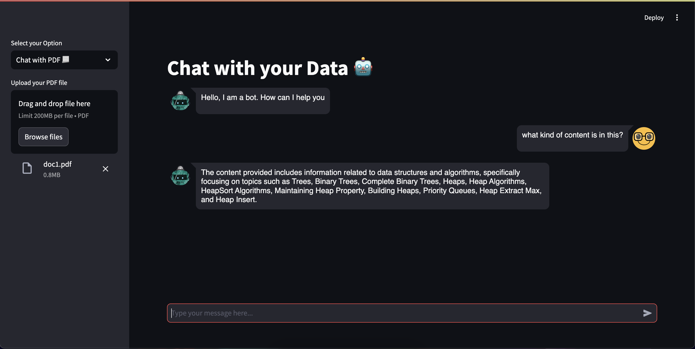

# Chatbot with LangChain and OpenAI API

This project features a sophisticated chatbot built using LangChain and the OpenAI API, with a user-friendly frontend designed using Streamlit. The chatbot integrates with personal data and intelligently responds to user queries based on various document formats, including CSV files, PDFs, and website URLs. It also supports maintaining a chat history for ongoing conversations.



## Key Features

- **Dynamic Data Integration**: Users can input documents (CSV, PDF) or provide website URLs, allowing the chatbot to access and process a wide range of data sources.
- **Intelligent Responses**: Leveraging the OpenAI API, the chatbot generates accurate and contextually relevant answers based on the provided documents or web content.
- **Chat History**: Maintains a record of the conversation history, allowing users to track previous interactions and context.
- **Streamlit Frontend**: A responsive and interactive frontend built with Streamlit for a seamless user experience.
- **Customizable and Extendable**: Easily adaptable to include additional data sources or to refine the chatbot's capabilities according to specific needs.

## Installation

To get started, clone the repository and install the necessary packages:

1. Clone the repository:
    ```bash
    git clone https://github.com/nuwan-dharmarathna/chat-with-docs.git
    cd chat-with-docs
    ```
2. Create a virtual environment & activate it:
    ```bash
    python -m venv env
    ```
    To activate:
    ```bash
    source env/bin/activate
    ```

3. Install the required packages:
    ```bash
    pip install -r requirements.txt
    ```

## Usage

1. Ensure you have an OpenAI API key and set it up in your environment variables.
2. Run the Streamlit app:
    ```bash
    streamlit run app.py
    ```
3. Interact with the chatbot through the Streamlit interface by providing documents or URLs, and ask questions to receive relevant answers. The chat history feature will keep track of your conversation for reference.

## Requirements

The project dependencies are listed in the `requirements.txt` file. Ensure all packages are installed to guarantee the chatbot functions correctly.

## Contributing

Contributions are welcome! Please follow the standard fork-and-pull request workflow for submitting changes.
